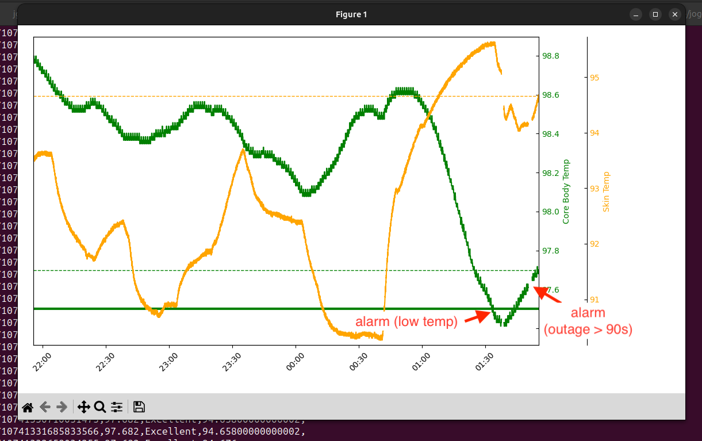

# corealarm

connect to [CORE body temp sensor](https://corebodytemp.com/ "corebodytemp.com") via BLE and alarm if outside target range for core and skin temps

run `corecollect.sh` and `corealarm.sh` in the same directory (shared access to log.csv)

these scripts will keep running corecollect.py and corealarm.py, respectively

optionally, run `python corechart.py` for a live-updating chart of the last 4 hours

both Windows (where you need Git for windows w/bash and linux utils) and Mac have a simplepyble bug (or usage bug) with notify() crashing

currently only comfirmed working on Linux
